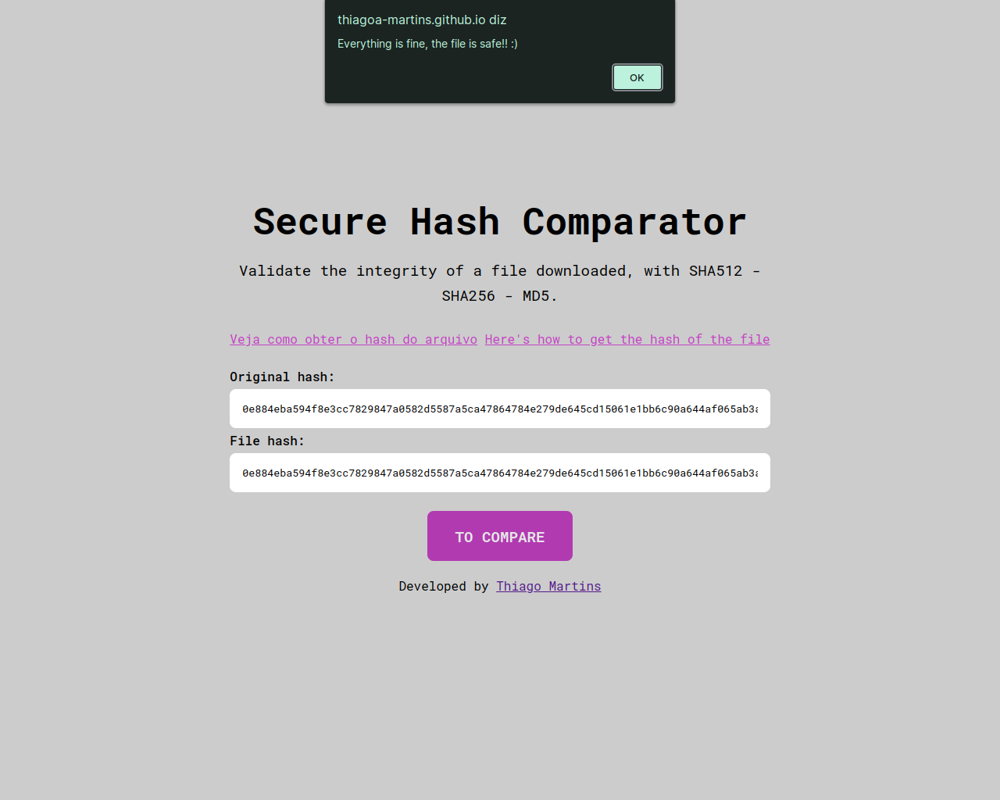
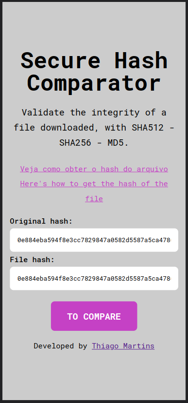

# Secure Hash Comparator

- Compare facilmente hashs SHA512, SHA256 ou MD5.
- O projeto foi desenvolvido com Html, Css e Javascript.

## Índice

- [Visão Geral](#visao-geral)
  - [A ideia](#a-ideia)
  - [Screenshot](#screenshot)
  - [Links](#links)
  - [Como rodar o projeto](#como-rodar-o-projeto)
- [Meu processo](#meu-processo)
  - [Construído com](#construido-com)
  - [O que eu aprendi](#o-que-eu-aprendi)
- [Autor](#autor)

## Visao Geral

### A ideia

Você sabe o que é SHA512, SHA256 ou MD5? 

Tenho certeza que você já viu essas siglas em algum lugar da internet, haha.

Elas são hashs. Hash é uma pequena função que resume um dado, nesse caso um código usado para verificar se um arquivo permanece intacto, livre de vírus. Pensando nisso para facilitar minha vida na hora de verificar um arquivo desenvolvi essa aplicação, quem quiser usar fique a vontade. :)

### Screenshot




### Links

- URL do repositório: [Código](https://github.com/thiagoa-martins/secure-hash-comparator)

### Como rodar o projeto

- Acesse o site: [Site](https://thiagoa-martins.github.io/secure-hash-comparator/)

## Meu processo

### Construido com

- Marcação HTML5 semântica
- Propriedades personalizadas de CSS
- Flexbox
- Primeiro fluxo de trabalho para desktop
- JavaScript


### O que eu aprendi

Entender melhor como hashs funcionam e trabalhar refatoração de código.

```html
<form id="form" action="#">
    <label>
        Original hash: <input id="hash" type="text" pattern="[0-9A-Za-z].{1,}" title="There is an invalid character or less than 8 characters">
        <label></label>
    </label>
    
    <label>
        File hash: <input id="fileHash" type="text" pattern="[0-9A-Za-z].{1,}">
        <label></label>
    </label>
    
    <button id="btn">To compare</button>
</form>
```

```css
main .article form label input.error {
    border: 1px solid var(--color-quinary);
    outline-color: var(--color-quinary);
}

main .article form label input.error::placeholder {
    color: var(--color-quinary);
}

main .article form label label.message {
    display: block;
    color: var(--color-quinary);
    font-weight: 400;
    font-size: 0.8rem;
}
```

```js
btn.addEventListener("click", () => {
    inputs.forEach(input => {

        validateData(input);

        input.addEventListener("keyup", () => {
            validateData(input);
        });
    });

    checkHash();
});
```

## Autor

- Github - [thiagoa-martins](https://github.com/thiagoa-martins)
- Linkedin - [thiagoa-martins](https://www.linkedin.com/in/thiagoa-martins/)
